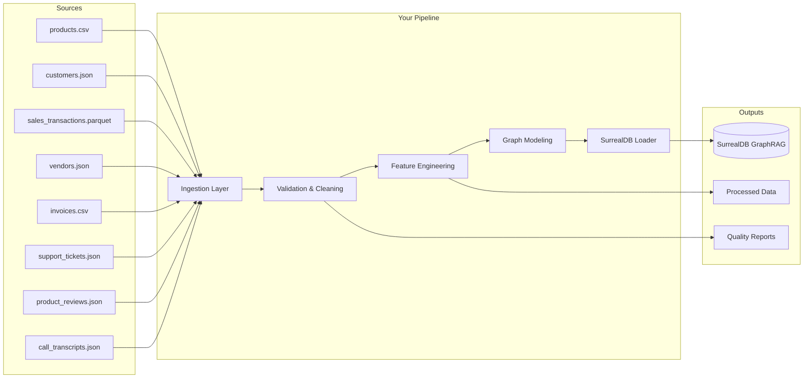
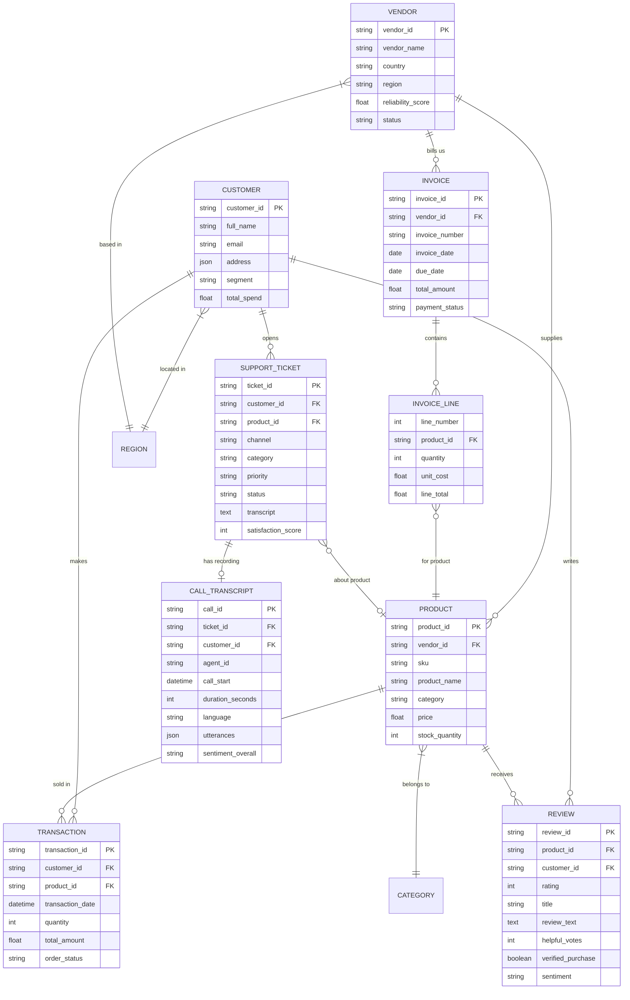
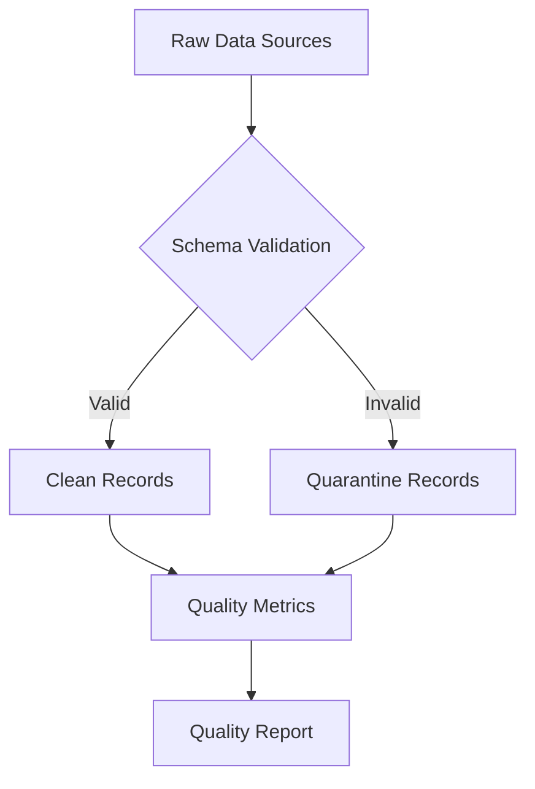
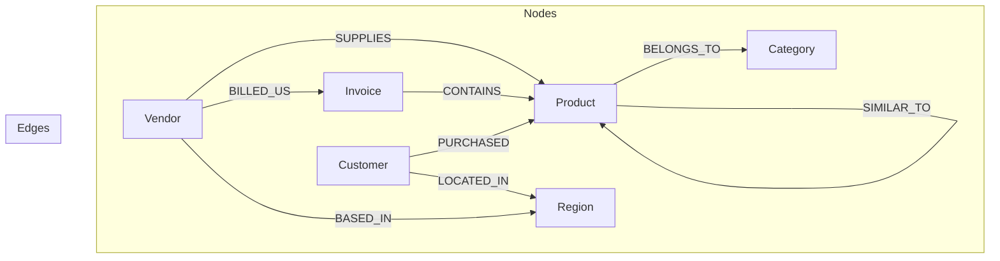
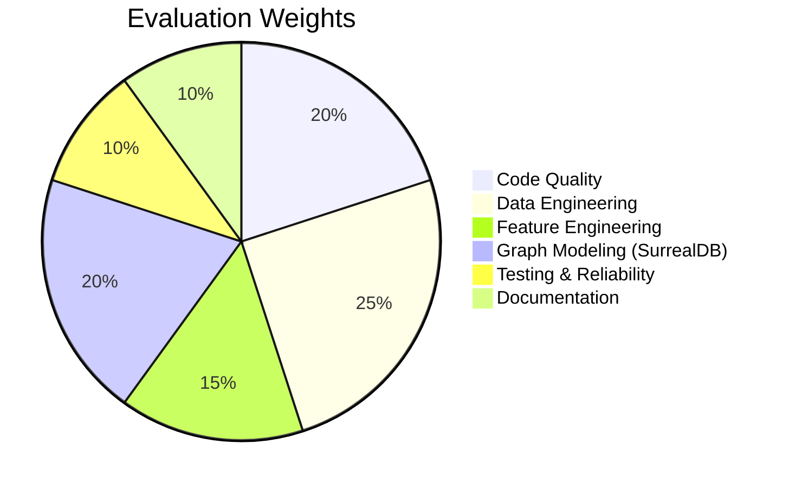

# Senior Data Engineer - Take-Home Assessment

## Overview

Welcome to the technical assessment for the **Senior Data Engineer** position. This exercise is designed to evaluate your ability to build production-quality data pipelines, handle real-world data quality challenges, perform feature engineering, and model data for a graph database (SurrealDB GraphRAG).

**Time Expectation:** 4-8 hours of focused work (you have up to 3 days to submit)

**Domain Context:** You are working with an e-commerce company that wants to leverage its data for AI-powered recommendations and analytics. The data comes from various source systems with known quality issues that reflect real-world scenarios.

---

## Scenario

Your company has acquired data from multiple sources: product catalogs, customer records, sales transactions, and vendor information. Your task is to build a data pipeline that:

1. **Ingests** raw data from multiple formats
2. **Cleans and validates** the data, handling quality issues
3. **Engineers features** for analytics and ML use cases
4. **Models and loads** the data into a SurrealDB graph database for GraphRAG applications



---

## Data Description

You are provided with eight interconnected data sources representing an e-commerce business. The data **intentionally contains various data quality issues** that reflect real-world scenarios you must identify and handle.

### Source Files

| File | Format | Description | Records |
|------|--------|-------------|---------|
| `data/products.csv` | CSV | Product catalog with attributes | ~500 |
| `data/customers.json` | JSON | Customer profiles with nested addresses | ~1,000 |
| `data/sales_transactions.parquet` | Parquet | B2C transaction history | ~5,000 |
| `data/vendors.json` | JSON | Vendor/supplier information | 10 |
| `data/invoices.csv` | CSV | B2B invoices from vendors (inventory purchases) | ~800 |
| `data/support_tickets.json` | JSON | Customer support tickets with summaries | ~20 |
| `data/product_reviews.json` | JSON | Product reviews with ratings and sentiment | ~30 |
| `data/call_transcripts.json` | JSON | Detailed phone call transcripts with speaker diarization | ~10 |

### Data Relationships



### Data Types Covered

The datasets include a comprehensive range of data types to test your handling capabilities:

| Data Type | Examples in Dataset |
|-----------|---------------------|
| **Strings** | product_name, customer_name, vendor_name |
| **Integers** | quantity, stock_quantity, review_count |
| **Floats** | price, total_amount, reliability_score |
| **Dates** | transaction_date, registration_date |
| **Timestamps** | created_at, updated_at |
| **Booleans** | is_active, email_verified |
| **JSON/Nested** | address, contact, preferences |
| **Arrays/Lists** | categories, certifications, tags |
| **Enums** | status, segment, payment_method |
| **Nullable** | Various fields with intentional nulls |
| **UUIDs/IDs** | product_id, customer_id, transaction_id |

### Known Data Quality Issues

The data contains **intentional issues** you should identify and handle:

**Products:**
- Duplicate SKUs
- Negative prices
- Missing categories
- Inconsistent date formats
- Invalid vendor references (orphaned records)
- Inconsistent boolean representations
- Mixed case naming conventions
- Encoding issues (special characters)

**Customers:**
- Duplicate and invalid email addresses
- Inconsistent phone number formats
- Missing required fields
- Future dates (invalid registration dates)
- Inconsistent gender values
- Invalid age values
- Mixed date formats

**Sales Transactions:**
- Negative quantities (returns/refunds)
- Zero quantities
- Invalid customer references
- Invalid product references
- Duplicate transactions
- Inconsistent currency codes
- Mixed boolean representations

**Vendors:**
- Inactive vendors with products
- Missing contact information
- Pending approval status with transactions

**Invoices:**
- Duplicate invoice numbers
- Invalid vendor references
- Line items referencing non-existent products
- Calculation mismatches (totals don't add up)
- Negative quantities (credits/returns)
- Inconsistent date formats
- Payment dates before invoice dates
- Inconsistent currency codes
- Nested JSON in CSV (line_items_json column)

**Support Tickets:**
- Invalid customer references (INVALID_ID)
- Missing ticket IDs (empty strings)
- Inconsistent channel values (lowercase vs UPPERCASE)
- Inconsistent status values (mixed case)
- Invalid date formats (20-03-2025 instead of ISO)
- Satisfaction scores out of range (6 when max is 5)
- Null satisfaction scores for resolved tickets
- Null resolved_at timestamps for resolved tickets
- Missing product references for product-related tickets

**Product Reviews:**
- Invalid product references (PRD-INVALID)
- Missing review IDs (empty strings)
- Invalid ratings (negative values, null)
- Inconsistent date formats (25/03/2025 vs ISO)
- Reviews by customers who never purchased (verified_purchase mismatch)
- Missing sentiment analysis for completed reviews

**Call Transcripts:**
- Missing ticket references (null ticket_id)
- Invalid customer references (INVALID)
- Negative duration values
- Missing or incomplete utterance arrays
- Inconsistent sentiment values
- Quality scores outside valid range
- Timestamps out of order in utterances
- Missing agent information

---

## Tasks

### Task 1: Data Ingestion & Validation (Core)

Build a data ingestion pipeline that:

1. **Loads data** from all eight source files (CSV, JSON, Parquet)
2. **Validates data** against defined schemas
3. **Generates a data quality report** summarizing all issues found
4. **Handles errors gracefully** without failing the entire pipeline



**Deliverables:**
- [ ] Ingestion code supporting all five source files
- [ ] Schema definitions (use Pydantic, Pandera, or similar)
- [ ] Data quality report (markdown or HTML)
- [ ] Quarantine file with rejected records and rejection reasons

---

### Task 2: Data Cleaning & Transformation (Core)

Clean and transform the validated data:

1. **Standardize** formats (dates, phone numbers, booleans, currencies)
2. **Resolve** duplicates (define and implement deduplication strategy)
3. **Handle** missing values (imputation, defaults, or flagging)
4. **Normalize** inconsistent values (case, encoding, formats)
5. **Validate** referential integrity (fix or flag orphaned records)

**Deliverables:**
- [ ] Transformation code with clear data lineage
- [ ] Documentation of cleaning rules applied
- [ ] Statistics on records cleaned vs. rejected

---

### Task 3: Feature Engineering (Core)

Create derived features for analytics and ML:

**Customer Features:**
- `customer_lifetime_value`: Total spend adjusted for tenure
- `purchase_frequency`: Orders per month since registration
- `average_order_value`: Mean transaction amount
- `days_since_last_purchase`: Recency metric
- `customer_segment_score`: Derived from RFM analysis

**Product Features:**
- `revenue_contribution`: Total revenue from this product
- `velocity_score`: Sales frequency metric
- `stock_turnover_rate`: Stock efficiency
- `price_tier`: Low/Medium/High/Premium categorization
- `vendor_reliability_weighted_score`: Product score adjusted by vendor reliability

**Vendor Features:**
- `total_products_supplied`: Count of active products
- `revenue_generated`: Total sales from vendor's products
- `product_quality_score`: Average rating of vendor's products
- `invoice_payment_rate`: Percentage of invoices paid on time
- `average_invoice_value`: Mean invoice amount
- `total_outstanding_balance`: Sum of unpaid invoice balances

**Invoice Features:**
- `days_to_payment`: Time between invoice and payment dates
- `days_overdue`: Days past due date (for unpaid invoices)
- `line_item_diversity`: Number of unique products per invoice
- `discount_rate_achieved`: Actual discount vs. standard terms
- `reconciliation_flag`: Whether invoice matches expected product costs

**Deliverables:**
- [ ] Feature engineering code
- [ ] Feature documentation (definitions, formulas, business logic)
- [ ] Sample output showing computed features

---

### Task 4: Graph Modeling & SurrealDB Loading (Advanced)

Model the data as a graph and load it into SurrealDB for GraphRAG applications:

1. **Design** the graph schema with nodes and edges
2. **Implement** the data loading logic for SurrealDB
3. **Create** sample queries demonstrating graph traversal



**Graph Schema Requirements:**

```surql
-- Example SurrealDB schema (candidates should design their own)

-- Nodes
DEFINE TABLE vendor SCHEMAFULL;
DEFINE TABLE product SCHEMAFULL;
DEFINE TABLE customer SCHEMAFULL;
DEFINE TABLE category SCHEMAFULL;
DEFINE TABLE region SCHEMAFULL;
DEFINE TABLE invoice SCHEMAFULL;

-- Edges (relationships)
DEFINE TABLE supplies SCHEMAFULL;      -- vendor -> product
DEFINE TABLE purchased SCHEMAFULL;     -- customer -> product (with transaction details)
DEFINE TABLE belongs_to SCHEMAFULL;    -- product -> category
DEFINE TABLE located_in SCHEMAFULL;    -- customer/vendor -> region
DEFINE TABLE billed SCHEMAFULL;        -- vendor -> invoice
DEFINE TABLE invoice_item SCHEMAFULL;  -- invoice -> product (line items)
```

**Sample Graph Queries to Implement:**

1. Find all products from vendors with reliability score > 90
2. Get customer purchase history with product and vendor details
3. Find related products (same category, same vendor, bought together)
4. Identify top customers by vendor (who buys most from each vendor)
5. Calculate vendor influence score (reach to customers)
6. Reconcile invoices: match invoice line items to products and verify costs
7. Find vendors with overdue invoices and their affected products
8. Calculate vendor payment performance vs. product sales correlation

**Deliverables:**
- [ ] SurrealDB schema design document
- [ ] Data loading scripts
- [ ] At least 5 graph queries with explanations
- [ ] Brief writeup on graph modeling decisions

---

### Task 5: Production Readiness (Senior Expectations)

Demonstrate senior-level engineering practices:

1. **Testing:** Unit tests for critical functions, integration test for pipeline
2. **Logging:** Structured logging throughout the pipeline
3. **Configuration:** Externalized config (no hardcoded paths/values)
4. **Documentation:** Docstrings, type hints, and architecture documentation
5. **Error Handling:** Graceful degradation, meaningful error messages
6. **Idempotency:** Pipeline can be re-run safely

**Deliverables:**
- [ ] Test suite with >70% coverage on core logic
- [ ] Configuration file (YAML/TOML)
- [ ] `ARCHITECTURE.md` explaining design decisions
- [ ] Logging output examples

---

## Project Structure

Organize your submission as follows:

```
data-engineering/
├── README.md                    # This file
├── ARCHITECTURE.md              # Your design decisions document
├── config/
│   └── pipeline_config.yaml     # Configuration
├── data/
│   ├── products.csv             # Raw product data
│   ├── customers.json           # Raw customer data
│   ├── sales_transactions.parquet  # Raw B2C transaction data
│   ├── vendors.json             # Raw vendor data
│   └── invoices.csv             # Raw B2B invoice data
├── src/
│   ├── __init__.py
│   ├── ingestion/               # Task 1: Data loading
│   ├── validation/              # Task 1: Schema validation
│   ├── cleaning/                # Task 2: Data cleaning
│   ├── features/                # Task 3: Feature engineering
│   ├── graph/                   # Task 4: Graph modeling & SurrealDB
│   └── utils/                   # Shared utilities
├── tests/
│   ├── unit/
│   └── integration/
├── outputs/
│   ├── quality_report.md
│   ├── quarantine/
│   └── processed/
├── notebooks/                   # Optional: exploration/analysis
├── scripts/
│   └── generate_ecommerce_data.py  # Data generation script
├── requirements.txt             # Dependencies
└── run_pipeline.py              # Main entry point
```

---

## Evaluation Criteria

Your submission will be evaluated across these dimensions:



### Detailed Rubric

| Criteria | Excellent | Good | Needs Improvement |
|----------|-----------|------|-------------------|
| **Code Quality** | Clean, idiomatic Python; consistent style; proper abstractions | Functional with minor style issues | Disorganized; hard to follow |
| **Data Engineering** | Handles all edge cases; efficient transformations; proper validation | Covers main cases; reasonable approach | Missing validation; brittle code |
| **Feature Engineering** | Well-reasoned features; proper documentation; business value clear | Working features with basic docs | Features not well-defined |
| **Graph Modeling** | Elegant schema; efficient queries; clear rationale | Working model with basic queries | Schema doesn't leverage graph benefits |
| **Testing** | Comprehensive tests; good coverage; meaningful assertions | Core functions tested | Minimal or no tests |
| **Documentation** | Clear architecture doc; useful comments; good README | Basic documentation | Little to no documentation |

---

## Technical Requirements

- **Language:** Python 3.10+
- **Required Libraries:** 
  - pandas, polars, or similar for data processing
  - pydantic or pandera for validation
  - surrealdb (Python client)
- **Testing:** pytest
- **Optional but Recommended:**
  - duckdb for analytical queries
  - great_expectations for data quality
  - loguru for logging

---

## Getting Started

```bash
# 1. Create virtual environment
python -m venv venv
source venv/bin/activate  # On Windows: venv\Scripts\activate

# 2. Install dependencies
pip install -r requirements.txt

# 3. Start SurrealDB (using Docker)
docker run --rm -p 8000:8000 surrealdb/surrealdb:latest start --user root --pass root

# 4. Run the pipeline
python run_pipeline.py

# 5. Run tests
pytest tests/ -v --cov=src
```

### SurrealDB Quick Reference

```bash
# Connect to SurrealDB
surreal sql --conn http://localhost:8000 --user root --pass root --ns test --db ecommerce

# Or use Python client
from surrealdb import Surreal

async with Surreal("ws://localhost:8000/rpc") as db:
    await db.signin({"user": "root", "pass": "root"})
    await db.use("test", "ecommerce")
```

---


## Questions?

If you have questions about the requirements, please email [contact email]. We're happy to clarify scope but cannot provide implementation guidance.

---

## What We're Looking For

Beyond technical skills, we're evaluating:

- **Problem-solving approach:** How do you handle ambiguity and data quality issues?
- **Communication:** Can you explain your design decisions clearly?
- **Pragmatism:** Do you make reasonable trade-offs given time constraints?
- **Attention to detail:** Do you catch the data quality issues?
- **Production mindset:** Is this code you'd be comfortable deploying?
- **Graph thinking:** Do you understand when and how to leverage graph relationships?

Good luck! We look forward to reviewing your submission.
