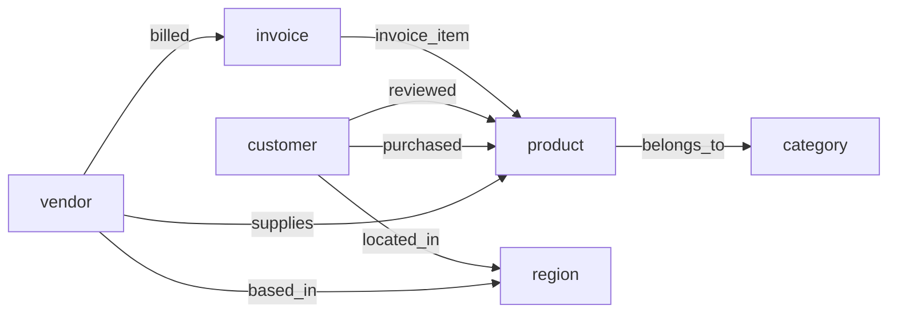

# Graph Data Model Design

## Overview

This document describes the SurrealDB graph modeling layer of the Medallion pipeline.
The graph layer reads validated Silver data and models it as a property graph with
typed nodes and edges for GraphRAG applications.

## Why Graph?

The e-commerce domain has natural graph relationships:
- Customers **purchase** products
- Vendors **supply** products
- Products **belong to** categories
- Invoices contain **line items** referencing products
- Customers **review** products

Graph traversal enables queries that are cumbersome in relational SQL, such as:
*"Which customers bought products from the same vendor?"* — a 2-hop graph walk.

## Schema Design

### Node Tables (6)

| Table | Source | ID Format | Rationale |
|-------|--------|-----------|-----------|
| `vendor` | Silver vendors.csv | `vendor:VND-001` | Core business entity |
| `product` | Silver products.csv | `product:PRD-001` | Core business entity |
| `customer` | Silver customers.csv | `customer:CUS-001` | Core business entity |
| `category` | Derived from products | `category:Electronics` | Enables category-based traversal |
| `region` | Derived from vendors | `region:North_America` | Enables geographic queries |
| `invoice` | Silver invoices.csv | `invoice:INV-xxx` | Financial entity |
| `support_ticket` | Silver support_tickets.csv | `support_ticket:TKT-xxx` | Issue tracking |
| `call_transcript` | Silver call_transcripts.csv | `call_transcript:CALL-xxx` | Voice interaction data |
| `agent` | Derived from tickets/calls | `agent:AGT-001` | Support staff entity |

### Edge Tables (8)

| Edge | Direction | Edge Properties | Rationale |
|------|-----------|-----------------|-----------|
| `supplies` | vendor → product | — | From FK in products |
| `belongs_to` | product → category | — | Derived from category column |
| `purchased` | customer → product | quantity, total_amount, date, status | Transaction data on edge |
| `located_in` | customer → region | — | Geographic association |
| `based_in` | vendor → region | — | From vendor region column |
| `billed` | vendor → invoice | — | From FK in invoices |
| `invoice_item` | invoice → product | line_number, qty, cost, total | Line item data on edge |
| `reviewed` | customer → product | rating, sentiment, verified | Review data on edge |
| `raised` | customer → support_ticket | — | Customer initiates support |
| `about` | support_ticket → product | — | Ticket relates to specific product |
| `handled_by` | support_ticket → agent | — | Agent responsible for ticket |
| `includes_transcript`| support_ticket → call_transcript | — | Voice evidence for ticket |
| `conducted_by` | call_transcript → agent | — | Agent on the call |

## Design Decisions

### 1. Transactions as Edges, Not Nodes

We model transactions as `purchased` edges (customer → product) rather than as
separate nodes. This trade-off favors simpler graph traversal at the cost of
losing some per-transaction identity.

**Rationale:** The primary GraphRAG use cases ("what else did this customer buy?",
"who else bought this product?") require traversing through purchases, not querying
individual transaction records. The transaction properties (date, amount, status)
are stored as edge fields.

### 2. SCHEMAFULL with Typed `in`/`out`

All tables use `SCHEMAFULL` mode with explicit `DEFINE FIELD in/out TYPE record<table>`
constraints. This enforces directional relationships at the database level.

### 3. Categories and Regions as First-Class Nodes

Rather than storing category/region as string attributes, we extract them as
nodes to enable graph-native queries like "find all products in the same category"
via `product→belongs_to→category←belongs_to←product`.

### 4. Unique Indexes on Edges

All 1:1 and M:1 edges have `UNIQUE` indexes on `(in, out)` to prevent
duplicate relationships. The `purchased` edge allows multiple edges between
the same customer-product pair (representing different transactions).

## Graph Visualization

## Sample Queries

See `src/graph/queries.py` for 11 documented graph traversal queries covering:

1. **Reliable vendor products** — vendor reliability filtering
2. **Customer purchase history** — multi-hop vendor resolution
3. **Related products** — category/co-purchase similarity
4. **Top customers by vendor** — revenue attribution
5. **Vendor influence** — customer reach analysis
6. **Invoice reconciliation** — line item mismatch detection
7. **Overdue vendors** — supply chain risk
8. **Payment vs sales** — vendor financial correlation
9. **Support burden** — products with high ticket volume
10. **Agent performance** — satisfaction & sentiment analysis
11. **Support journey** — full customer interaction history
