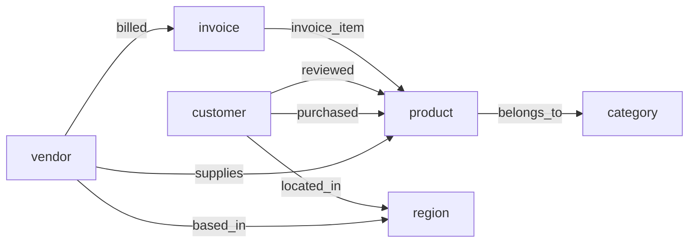

# Graph Data Model Design

## Overview

This document describes the SurrealDB graph modeling layer of the Medallion pipeline.
The graph layer reads validated Silver data and models it as a property graph with
typed nodes and edges for GraphRAG applications.

## Why Graph?

The e-commerce domain has natural graph relationships:
- Customers **purchase** products
- Vendors **supply** products
- Products **belong to** categories
- Invoices contain **line items** referencing products
- Customers **review** products

Graph traversal enables queries that are cumbersome in relational SQL, such as:
*"Which customers bought products from the same vendor?"* — a 2-hop graph walk.

## Schema Design

## Detailed Schema Reference

### Node Tables (9)

All node tables are defined as `SCHEMAFULL`.

| Node | Fields | ID Format | Description |
|------|--------|-----------|-------------|
| **`vendor`** | `vendor_name` (str) `country` (str) `region` (str) `reliability_score` (float) `status` (str) | `vendor:VND-001` | Supplier entities. |
| **`product`** | `product_name` (str) `sku` (str) `category` (str) `price` (float) `cost` (float) `stock_quantity` (int) `rating` (float) `is_active` (bool) | `product:PRD-001` | Items for sale. |
| **`customer`** | `full_name` (str) `email` (str) `phone` (str) `segment` (str) `total_spend` (float) `registration_date` (date) `is_active` (bool) | `customer:CUS-001` | Registered users. |
| **`category`** | `name` (str) | `category:Electronics` | Derived from product categories. |
| **`region`** | `name` (str) | `region:North_America` | Derived from vendor/customer regions. |
| **`invoice`** | `invoice_date` (date) `due_date` (date) `total_amount` (float) `payment_status` (str) `payment_terms` (str) | `invoice:INV-001` | B2B invoices from vendors. |
| **`support_ticket`** | `status` (str) `priority` (str) `satisfaction_score` (int) `created_at` (datetime) `resolved_at` (datetime) | `support_ticket:TKT-001` | Customer support cases. |
| **`call_transcript`** | `sentiment_overall` (str) `duration_seconds` (int) `quality_score` (float) `transfers` (int) `call_start` (datetime) | `call_transcript:CALL-001` | Voice call logs. |
| **`agent`** | `name` (str) | `agent:AGT-001` | Support agents (derived). |

### Edge Tables (14)

All edge tables are `SCHEMAFULL` with typed `in` (source) and `out` (target) fields.

#### Transactional & Core Relationships

| Edge | Source → Target | Properties | Description |
|------|-----------------|------------|-------------|
| **`purchased`** | `customer` → `product` | `transaction_id` (str) `quantity` (int) `total_amount` (float) `transaction_date` (date) `order_status` (str) `discount_percent` (float) `tax_rate` (float) | Customer purchase history. Allows multiple edges per pair. |
| **`supplies`** | `vendor` → `product` | — | Vendor supplies this product. |
| **`billed`** | `vendor` → `invoice` | — | Vendor issued this invoice. |
| **`invoice_item`** | `invoice` → `product` | `line_number` (int) `quantity` (int) `unit_cost` (float) `line_total` (float) | Line items within an invoice. |
| **`reviewed`** | `customer` → `product` | `review_id` (str) `rating` (int) `sentiment` (str) `verified_purchase` (bool) `response_text` (str) | Customer product reviews. |

#### Structural Relationships

| Edge | Source → Target | Description |
|------|-----------------|-------------|
| **`belongs_to`** | `product` → `category` | Product categorization. |
| **`based_in`** | `vendor` → `region` | Vendor geographic location. |
| **`located_in`** | `customer` → `region` | Customer geographic location. |
| **`similar_to`** | `product` → `product` | Products in same category (ring topology). |

#### Support Relationships

| Edge | Source → Target | Description |
|------|-----------------|-------------|
| **`raised`** | `customer` → `support_ticket` | Customer opened a ticket. |
| **`about`** | `support_ticket` → `product` | Ticket relates to a product. |
| **`handled_by`** | `support_ticket` → `agent` | Agent assigned to ticket. |
| **`includes_transcript`** | `support_ticket` → `call_transcript` | Call associated with ticket. |
| **`conducted_by`** | `call_transcript` → `agent` | Agent who handled the call. |

## Design Decisions

### 1. Transactions as Edges, Not Nodes

We model transactions as `purchased` edges (customer → product) rather than as
separate nodes. This trade-off favors simpler graph traversal at the cost of
losing some per-transaction identity.

**Rationale:** The primary GraphRAG use cases ("what else did this customer buy?",
"who else bought this product?") require traversing through purchases, not querying
individual transaction records. The transaction properties (date, amount, status)
are stored as edge fields.

### 2. SCHEMAFULL with Typed `in`/`out`

All tables use `SCHEMAFULL` mode with explicit `DEFINE FIELD in/out TYPE record<table>`
constraints. This enforces directional relationships at the database level.

### 3. Categories and Regions as First-Class Nodes

Rather than storing category/region as string attributes, we extract them as
nodes to enable graph-native queries like "find all products in the same category"
via `product→belongs_to→category←belongs_to←product`.

### 4. Unique Indexes on Edges

All 1:1 and M:1 edges have `UNIQUE` indexes on `(in, out)` to prevent
duplicate relationships. The `purchased` edge allows multiple edges between
the same customer-product pair (representing different transactions).

## Graph Visualization

## Sample Queries

See `src/graph/queries.py` for 9 documented graph traversal queries covering:

1. **Reliable vendor products** — vendor reliability filtering
2. **Customer purchase history** — multi-hop vendor resolution
3. **Related products** — same category, same vendor, and co-purchase neighborhoods
4. **Co-purchased products** — items bought by overlapping customer sets
5. **Top customers by vendor** — customer lists with spend context by vendor
6. **Vendor influence** — customer reach analysis
7. **Invoice reconciliation** — line item mismatch detection
8. **Overdue vendors** — supply chain risk
9. **Payment vs sales** — cost/revenue comparison with ratio-style correlation proxy
